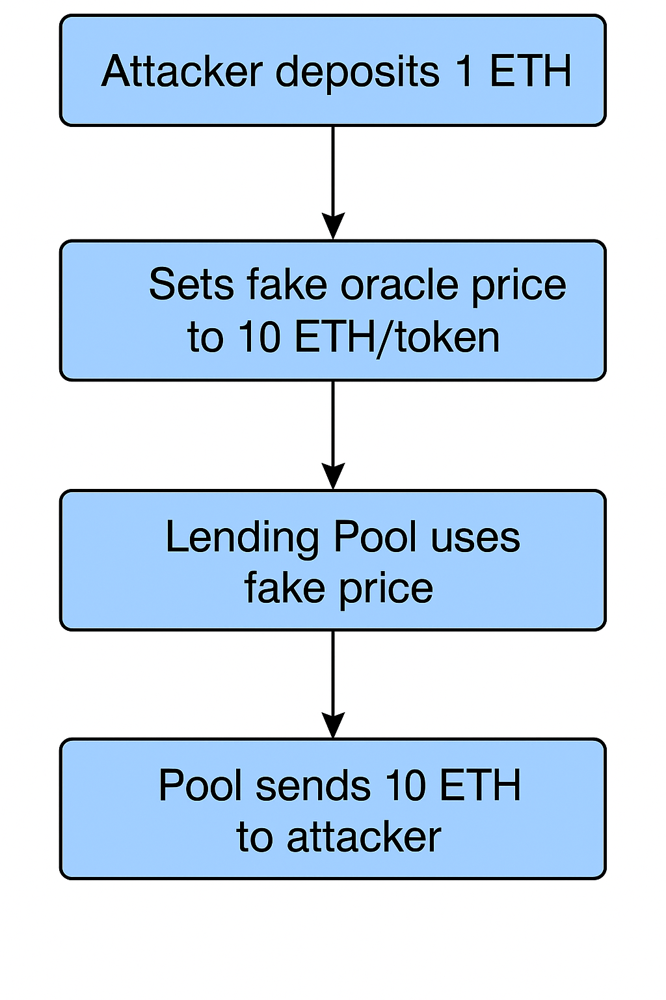

# 🛰️ Oracle Manipulation Attack Demo

This project demonstrates a classic **Oracle Manipulation vulnerability** in decentralized finance (DeFi). The attacker abuses a manipulatable price oracle to overstate collateral value and drain funds from a lending pool.

---

## 🧠 Overview

Insecure oracles are a major threat in DeFi protocols. If a lending platform trusts a price feed that can be externally altered, an attacker can:

- Deposit a small amount of collateral
- Inflate the token price via the oracle
- Borrow a disproportionate amount of ETH
- Walk away with profit while the protocol takes the loss

---

## 📁 Contracts

| File                   | Purpose                                      |
|------------------------|----------------------------------------------|
| `SimpleOracle.sol`     | A vulnerable oracle that anyone can set      |
| `OracleLendingPool.sol`| A lending pool that uses the oracle price    |
| `OracleAttacker.sol`   | Exploits the oracle to drain ETH             |

---

## 🚀 Setup and Testing (Remix)

### 🧪 Step-by-Step

1. **Compile all contracts**:
   - `SimpleOracle.sol`
   - `OracleLendingPool.sol`
   - `OracleAttacker.sol`

2. **Deploy `SimpleOracle`**  
   - Save the address

3. **Deploy `OracleLendingPool`**  
   - Pass the `SimpleOracle` address as the constructor argument  
   - Save the pool’s address

4. **Fund the pool with 10 ETH**  
   - Set `VALUE = 10` ETH  
   - Click `transact()` on `OracleLendingPool` (triggers fallback `receive()`)

5. **Deploy `OracleAttacker`**  
   - Pass the `SimpleOracle` and `OracleLendingPool` addresses as constructor arguments

6. **Run the attack**  
   - Set `VALUE = 1` ETH  
   - Click `attack()` on `OracleAttacker`

---

## 📊 Attack Flow

## 🔍 Result Summary
After the attack() function is executed:

Contract	ETH Balance	Notes
OracleAttacker	10 ETH	1 ETH deposit + 9 ETH profit
OracleLendingPool	~0 ETH (drained)	Loss due to manipulated price

You can confirm this using:

getBalance() on OracleAttacker

getPoolBalance() on OracleLendingPool
